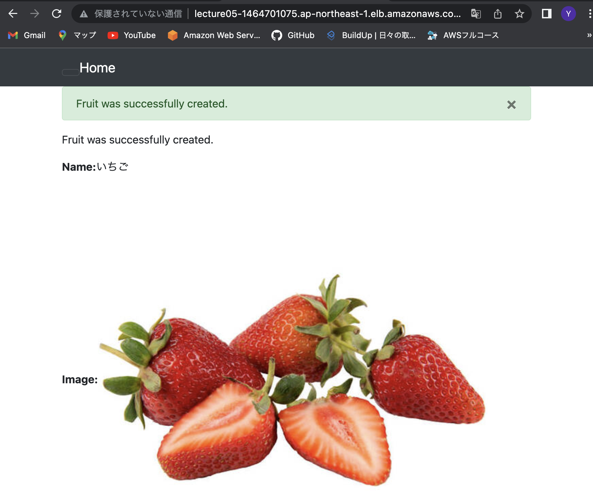

# 第５回課題
## 環境構築
- ターミナルからssh接続  
```ssh -i キー名.pem ec2-user@publicIP```  

- 各種インストール  
mysql  
mysql-devel  
git  
nodejs  
yarn  
rbenv  
ruby-build  
ruby  
gem  ```bundler install```  
rails  

- サンプルアプリのclone  
```git clone "サンプルアプリGitHubURL"```  
- database.ymlの編集  
database.yml.sampleの.sampleを削除  
```sudo vi database.yml```  
user: admin  
password: 任意設定  
host: RDSのエンドポイント  

- データベースの作成  
```bin/rails db:create```  
```bin/rails db:migrate```  

## 組み込みサーバ（puma）での動作確認  
- EC2インバウンドルールでポート3000開放  
```rails s -b 0.0.0.0```  
- ブラウザでEC2のパブリックIP:3000で接続  
application.cssに関するエラー表示  
```bundle exec rake assets:clean```  
```bundle exec rake assets:precompile```  
- 再度ブラウザで接続  
組み込みサーバでの動作確認完了  
  

  

  


## unicornのみでの動作確認  
- unicorn.rbの編集  
- EC2インバウンドルールで8080を開放  
- ブラウザでEC2のパブリックIP:8080で接続  
  

  


## nginxとunicornの連携  
- nginxのインストールと接続  
```sudo amazon-linux extras install nginx```  
```sudo systemctl start ngix```  

- EC2パブリックIP:80で接続  
welcame to nginx!
- rails.confの作成  
etc/nginx/conf.d←ここに作成する  
```sudo vi /etc/nginx/conf.d/rails.conf```  
記述内容  
server unix: アプリ名/tmp/sockets/unicorn.sock  
server name: EC2のパブリックIP  
root: アプリ名/public  
- nginx.confの編集  
- unicorn.rbの編集  
Listen ~/tmp/sockets  
pid ~/tmp/pid  
- assets.rb  
pathを設定
- curlでのソケット通信確認  
```curl --unix-socket /var/run/app.sock http://localhost/```  
**相対パスと絶対パスに注意*  
- 接続確認  
```bundle exec unicorn_rails -c config/unicorn.rb```  
unicornを起動  
EC2パブリックIP:80でブラウザ接続  
```ps -ef | grep unicorn | grep -v grep```  
```sudo systemctl status nginx```  
  

  

  

  

## ALB経由の接続確認  
### ALBの作成  
- ターゲットグループの作成  
- ALB作成  
AZとVPCを該当するものを選択すること  
- セキュリティグループ(ALB)  
HTTP-80  
HTTP-443　　　両者をインバウンドルールで開放  
- セキュリティグループ（EC2)  
HTTP-80  
ターゲットをALBセキュリティグループを指定  
インバウンドルールで開放  
  

  


### ALB経由の接続  
- development.rbの編集  
config/environments/development.rb  
Rails.application.configure do  
config.hosts<<ALBのDNS名を追加  
- 接続  
ALBのDNSをコピー、ブラウザで接続  
  

  

  

## S3への画像保存設定  
- バケットの作成  
EC2と同一リージョンを選択  
- S3操作権限をもつIAMユーザー作成  
ポリシーから`AmazonS3FullAccess`をアタッチ  
- アクセスキーIDとシークレットアクセスキーを控える  
- バケットポリシーの編集  
S3用ユーザーARN、S3バケットARNをコピーしてポリシージェネレータで編集  
JSON形式のアクセスポイントポリシーが生成されるので、デフォルトバケットポリシーを削除して上書き保存  
- storage.ymlの編集  
region:  
bucket:　それぞれ該当するもの記載  
- development.rbの編集  
config.active.storage.service=amazon  
- credentials.ymlの編集  
```EDITOR='vim' rails credentials:edit  ```
で編集画面へ移動  
access_key_id:  
secret_access_key:  
S3用ユーザーのものを記載  
"  "を使用した明示的宣言必要
- railsコンソールでの確認  
```rails c```でコンソール起動  
```Rails.application.credentials[:aws]```で、credentials.ymlの情報を確認  
  

  

  

  


### 構成図  

