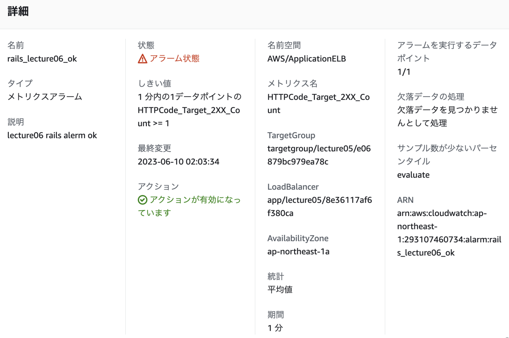

# 第６回課題  

## CloudTrail  
履歴３つピックアップ  
+ No.1  
イベント名　　ModifyTagetGroup  
内容　　　　　ターゲットグループを変更したロードバランサーに関する２項目  
　　　　　　　以下２項目は関連するVPC  
+ No.2  
イベント名　　StopDBinstance  
内容　　　　　RDSの一時停止  
　　　　　　　関連VPC、サブネットグループ、セキュリティグループ、KMSのKEY  
　　　　　　　DBパラメータグループ、関連するEC2サブネット  
+ No.3  
イベント名　　StopInstances  
内容　　　　　EC2インスタンスの一時停止  

+ 共通項目  
イベント名　　イベントID　　イベント時間　　ユーザー名　AWSアクセスキー  
イベントソース　　リクエストID　　エラーコード　　発信元IPアドレス  
読み取り専用　　AWSリージョン　　イベントタイプ　　イベントレコード  

+ 参照されるリソース  
イベントに関連するリソースが１つずつ記録されている  
 1. リソースタイプ　　RDS、EC2等  
 2. リソース名　　　　RDS,EC2等に設定したnameが表示される  
 3. AWS Configのリソースタイムライン　記録有効化で参照可能になる  

## Cloud Watch　アラーム設定とメール通知  
### 目標　→　railsアプリが使用可能、使用不可能、両者の監視と通知  

+ アラーム設定（ALB）  
Cloud Watchのコンソールから作成していく  
サービスはALBを選択  
メトリクスは  

     1. 使用可能状態  
     HTTPCode_Target_2XX_Count  

     2. 使用不可能状態  
     HTTPCode_Target_5XX_Count  

 と設定（EC2から応答があるかないか）  

 アラーム発生までの各種数値は任意で設定する  
 今回は１分以内に１より大きいで設定  

 使用可能状態のアラーム  
   

 使用不可能状態のアラーム  
 

+ SNSとの連携  
トピックを作成して、プロトコルをEmail、エンドポイントをアドレス  
自分のアドレスで受信した確認メールでサブスクリプションを承認  

サブスクリプション  
  

使用可能状態メール受信  
  

使用不可能状態メール受信  
  

## 見積もり  
[お見積もり](https://calculator.aws/#/estimate?id=8a312d79346a93e967c3c0b2ea806dca6d835809)  

## 利用料の確認  
+ 先月のEC2利用料  
  
